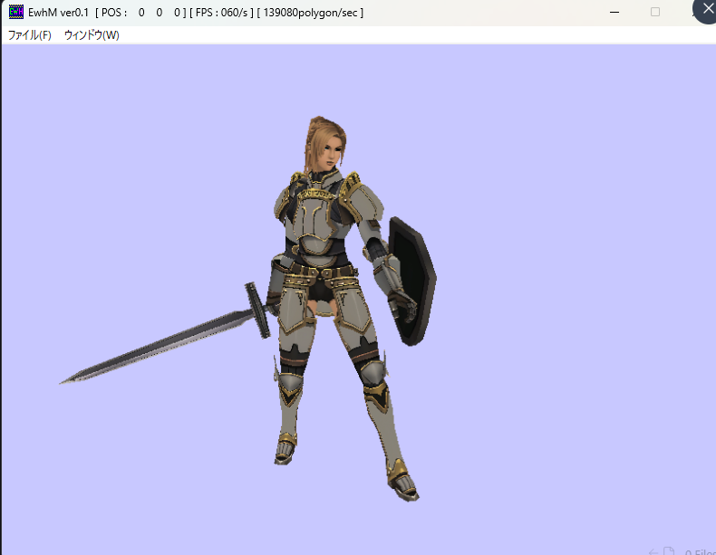
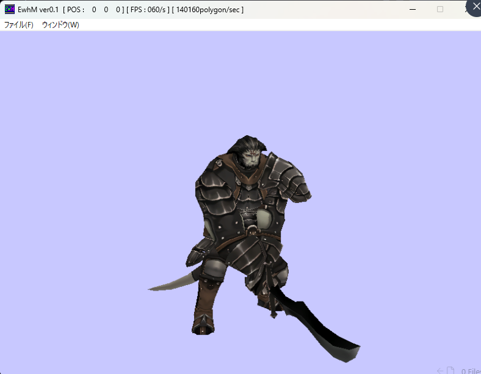
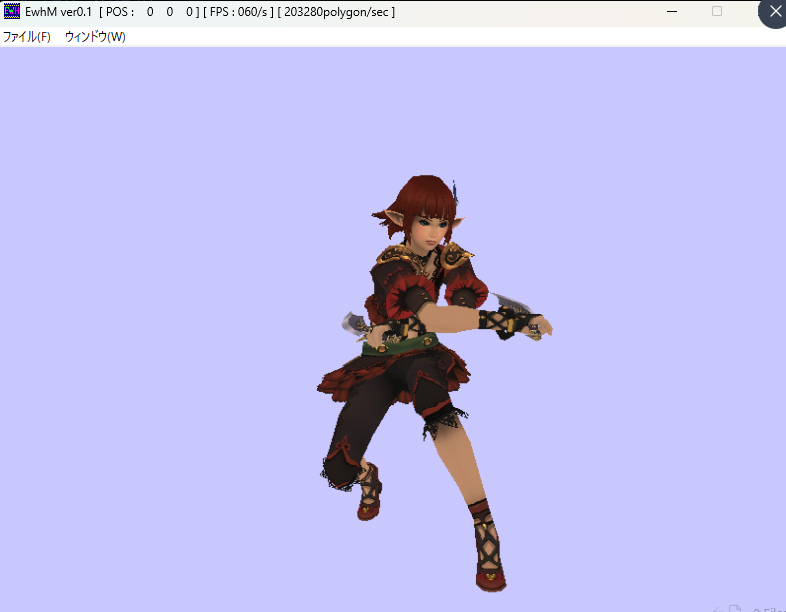
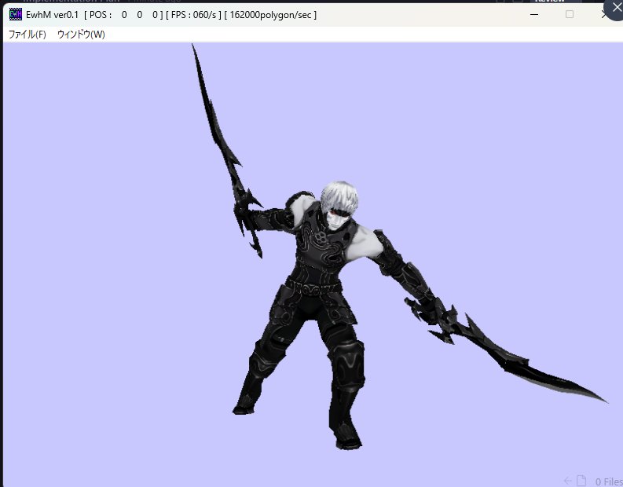
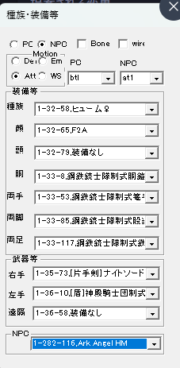

# EwhM (ModelTest) - FFXI Model Viewer & Converter

`EwhM` は、FFXI (Final Fantasy XI) がインストールされた環境において、ゲーム内のキャラクターモデルやデータを閲覧・変換するためのツールです。通常は見ることのできない詳細なモデル構造やアニメーションを確認することができます。

## 概要

- **目的**: FFXI のモデルデータを DirectX 9 を使用してレンダリングし、視覚的に確認・解析すること。
- **特徴**: FFXI 独自のデータ形式（DAT）や内部データ（DAT2）の読み込みに加え、標準的な 3D 形式（FBX, MQO, X-file）への出力をサポートします。

## スクリーンショット

### キャラクター表示例
ここにはキャラクターのレンダリング結果が表示されます。

 
 

> [!NOTE]
> 上記画像はキャラクターの表示例です。

### 操作パネル
モデルの種族、装備、モーションを切り替えるためのコントロールパネルです。

## 主な機能

- **モデル閲覧**: キャラクター (PC/NPC) の種族、顔、装備などを自由に組み合わせて表示。
- **アニメーション解析**: ボーン構造の表示、モーション（待機、攻撃、WS等）の再生。
- **エクスポート**:
  - FBX SDK を使用した FBX 形式への出力。
  - Metasequoia (MQO) 形式への書き出し。
  - DirectX X-file 形式のサポート。
- **頂点最適化**: 頂点のウェルディングや最適化機能。

## セットアップと要件

### 実行環境
- **Final Fantasy XI**: PC に FFXI がインストールされており、データフォルダが参照可能であること。
- **Windows**: DirectX 9.0c が動作する環境。

### 開発環境
- **Visual Studio**: プロジェクトは `.sln` および `.vcxproj` 形式で管理されています。
- **DirectX 9 SDK**: レンダリングエンジンのビルドに必要です。
- **FBX SDK**: FBX 形式の入出力機能に必要です。

## プロジェクト構造

- `WinMain.cpp / .h`: ユーザーインターフェースとアプリケーションのエントリポイント。
- `Model.cpp / .h`: モデルデータ、メッシュ、ボーン、アニメーションの管理クラス。
- `Dx.cpp / .h`: DirectX 9 デバイスの初期化と基本描画。
- `Render.cpp / .h`: 描画ループと 3D 空間の管理。
- `resource.rc`: アイコンやメニュー、ダイアログ（操作パネル）のリソース定義。

---
*本ツールは研究およびデータ解析を目的としています。使用にあたっては各規約を遵守してください。*
