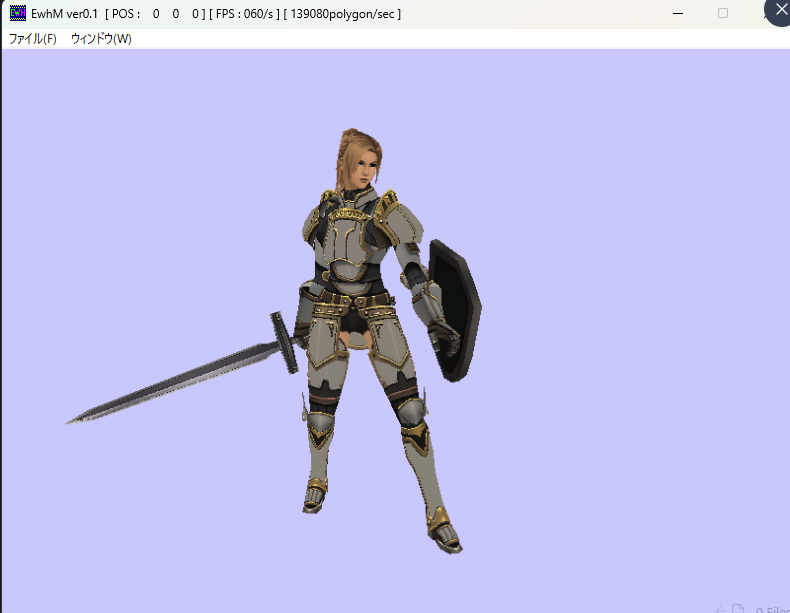
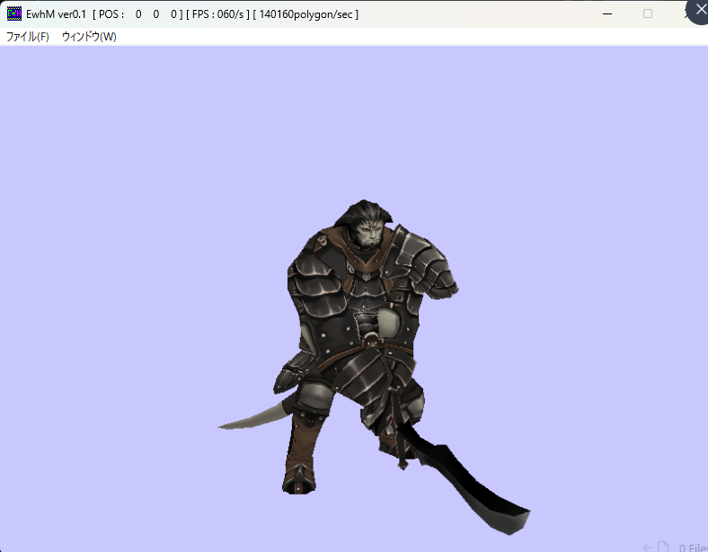
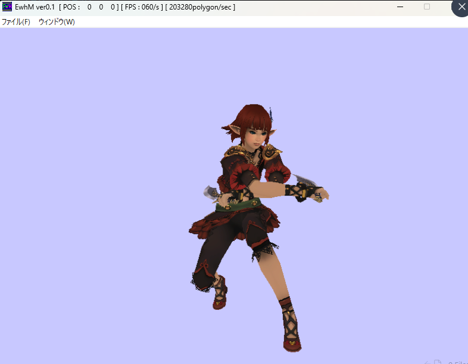
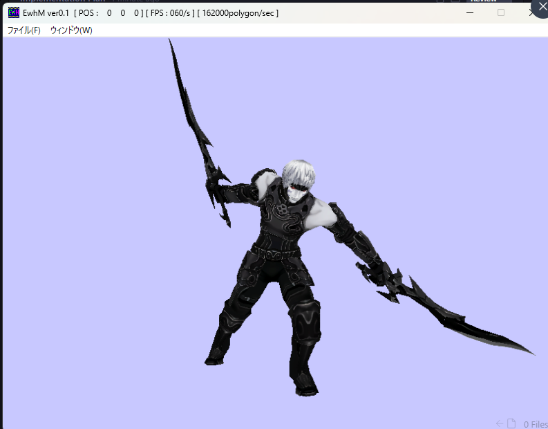
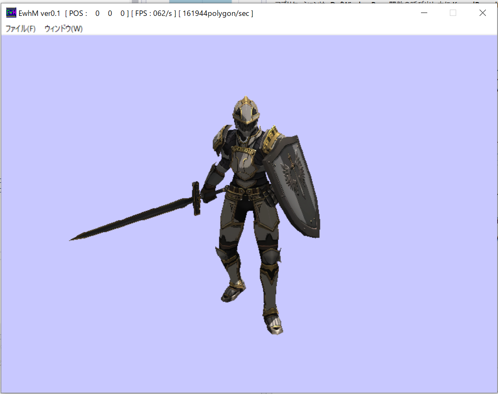
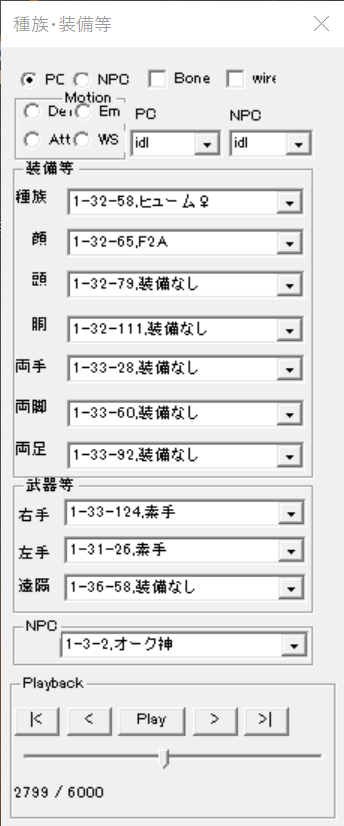

# EwhM (ModelTest) - FFXI Model Viewer & Converter

`EwhM` は、FFXI (Final Fantasy XI) がインストールされた環境において、ゲーム内のキャラクターモデルやデータを閲覧・変換するためのツールです。通常は見ることのできない詳細なモデル構造やアニメーションを確認することができます。

## 概要

- **目的**: FFXI のモデルデータを DirectX 11 を使用してレンダリングし、視覚的に確認・解析すること。
- **特徴**: FFXI 独自のデータ形式（DAT）や内部データ（DAT2）の読み込みに加え、標準的な 3D 形式（FBX, MQO, X-file）への出力をサポートします。

## スクリーンショット

### キャラクター表示例

 
 

> [!NOTE]
> 上記画像はキャラクターの表示例です。

### DX11レンダリング（Phong反射 + シャドウマップ）



### 4面図保存例（正面・背面・左側面・右側面）

バインドポーズ・正射影・シャドウなしで4方向を 1024×1024 PNG として出力します。

### 操作パネル

モデルの種族、装備、モーションを切り替えるためのコントロールパネルです。



| セクション | 内容 |
|---|---|
| 表示切替 | PC / NPC / Bone（ボーン表示）/ toon（トゥーンシェーディング）の切替ラジオボタン |
| Motion | モーション種別（Del/Em/Att/WS）の選択と PC・NPC 各コンボボックス |
| 装備等 | 種族・顔・頭・胴・両手・両脚・両足の装備をコンボボックスで選択 |
| 武器等 | 右手・左手・遠隔の武器をコンボボックスで選択 |
| NPC | NPC モデルのコンボボックス選択 |
| Playback | アニメーション再生コントロール。先頭（\|<）・前コマ（<）・再生/一時停止（Play）・次コマ（>）・末尾（>\|）ボタン、シークスライダー、現在フレーム / 総フレーム数の表示 |

## 主な機能

- **モデル閲覧**: キャラクター (PC/NPC) の種族、顔、装備などを自由に組み合わせて表示。
- **DX11 レンダリング**: Phong 反射モデルと PCF シャドウマップによる高品質描画。
- **アニメーション解析**: ボーン構造の表示、モーション（待機、攻撃、WS等）の再生。再生・一時停止、コマ送り（前後）、シークスライダーによる任意フレームへのジャンプをサポート。
- **エクスポート**:
  - FBX SDK を使用した FBX 形式への出力（アニメーション付き / なし切り替え可）。
  - Metasequoia (MQO) 形式への書き出し。
  - DirectX X-file 形式のサポート。
  - **4面図保存**: バインドポーズ・正射影投影で正面・背面・左側面・右側面を 1024×1024 PNG として保存。
- **頂点最適化**: 頂点のウェルディングや最適化機能。

## セーブメニュー

| メニュー項目 | 内容 |
|---|---|
| SAVEMQO | Metasequoia (MQO) 形式でモデルを保存 |
| SAVEX | DirectX X-file 形式でモデルを保存 |
| SAVEFBX | FBX 形式でモデルを保存（Shift キー押下でアニメーションなし） |
| 4面図を保存 | バインドポーズの正射影4方向ビューを PNG で保存 |
| 終了 | アプリケーションを終了 |

### 4面図保存について

- **ファイル名**: `front.png`（正面）/ `back.png`（背面）/ `left.png`（左側面）/ `right.png`（右側面）
- **解像度**: 1024 × 1024 px
- **投影**: 正射影（Orthographic）
- **ポーズ**: バインドポーズ（アニメーション未適用）
- **シャドウ**: なし（フラットライティング）
- 保存先フォルダはダイアログで選択します。

## ウィンドウ操作

| 操作 | 内容 |
|---|---|
| ウィンドウ枠ドラッグ | マウスでウィンドウ端をドラッグしてサイズ変更。16:9 アスペクト比に自動固定（最小幅 320px） |
| F11 | ボーダーレス全画面 ↔ ウィンドウモードのトグル切り替え |

- **初期ウィンドウサイズ**: 1280 × 720（16:9）
- アスペクト比は 16:9 固定。リサイズ時にプロジェクション行列・ビューポートが自動更新されます。

## セットアップと要件

### 実行環境

- **Final Fantasy XI**: PC に FFXI がインストールされており、データフォルダが参照可能であること。
- **Windows 10 / 11 (x64)**: DirectX 11 対応 GPU が必要です。

### 開発環境

- **Visual Studio 2022**: プロジェクトは `.sln` および `.vcxproj` 形式で管理されています。
- **DirectX 11 SDK**: Windows SDK に含まれます。
- **DirectXTex**: テクスチャ処理・PNG 保存に使用。
- **FBX SDK**: FBX 形式の入出力機能に必要です（FBX SDK 2020.2 を使用）。

## 実行方法と構成

ビルド後の出力フォルダ（`x64/Release` など）から直接実行します。

実行に必要なファイルは `ModelTest.exe` と同じディレクトリに配置してください。

- `ModelTest.exe`: アプリケーション本体。
- `libfbxsdk.dll`: FBX 形式のエクスポートに必要なライブラリ。
- `List/` フォルダ: 各種族やNPCの装備・モーション情報のリストファイル（`.lst`）が格納されています。
- `.ini`: パス設定などの初期化パラメータ（任意）。
- `icon1.ico`: アプリケーションのアイコンファイル。

## 設定ファイル (.ini)

実行ファイルと同じディレクトリに `.ini` という名前のファイルを配置することで、外部ファイルの読み込みパスをカスタマイズできます。

### 設定項目

- **MESH_PATH**: メッシュファイル（DAT）などのベースディレクトリを指定します。指定した場合、レジストリからの FFXI インストール自動検出を上書きします。
- **TEX_PATH**: テクスチャファイルの読み込み先ディレクトリを指定します。

### 設定例

```ini
[Other Path]
MESH_PATH = Z:\DataFBX\FFXI\
TEX_PATH = Z:\DataFBX\FFXI\
```

## プロジェクト構造

- `WinMain.cpp / .h`: ユーザーインターフェースとアプリケーションのエントリポイント。
- `Model.cpp / .h`: モデルデータ、メッシュ、ボーン、アニメーションの管理クラス。
- `Dx.cpp / .h`: DirectX 11 デバイスの初期化と基本描画。
- `Render.cpp / .h`: 描画ループ、3D 空間管理、4面図保存。
- `skinning_vs.hlsl`: スキニング頂点シェーダー（リニアブレンドスキニング）。
- `basic_ps.hlsl`: Phong 反射 + PCF シャドウマップ ピクセルシェーダー。
- `shadow_vs.hlsl`: シャドウマップ生成用頂点シェーダー。
- `toon_ramp.bmp`: トゥーンシェーディング用ランプテクスチャ（256×1、横軸=N・L）。
- `resource.rc`: アイコンやメニュー、ダイアログ（操作パネル）のリソース定義。

---
*本ツールは研究およびデータ解析を目的としています。使用にあたっては各規約を遵守してください。*

## 利用規約 (License)

本ソフトウェアは、商用利用および再配布を禁止しています。詳細は [LICENSE](LICENSE) ファイルをご確認ください。

© 2026 yisikawa
